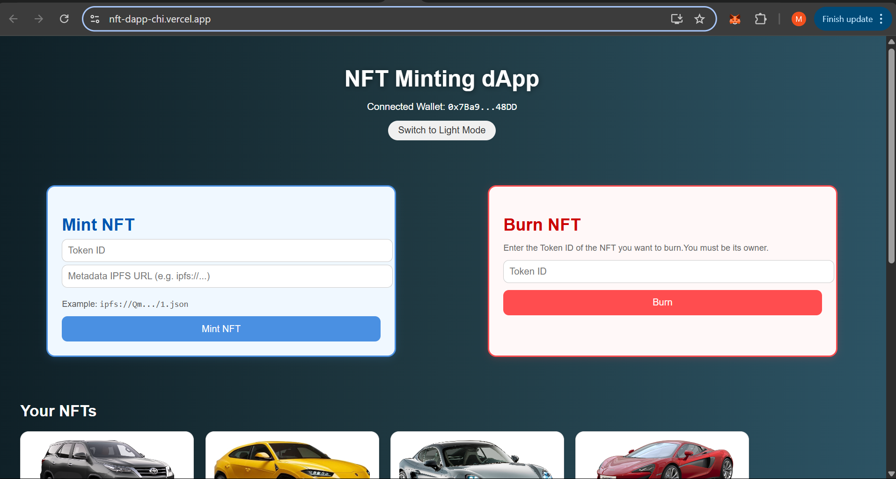
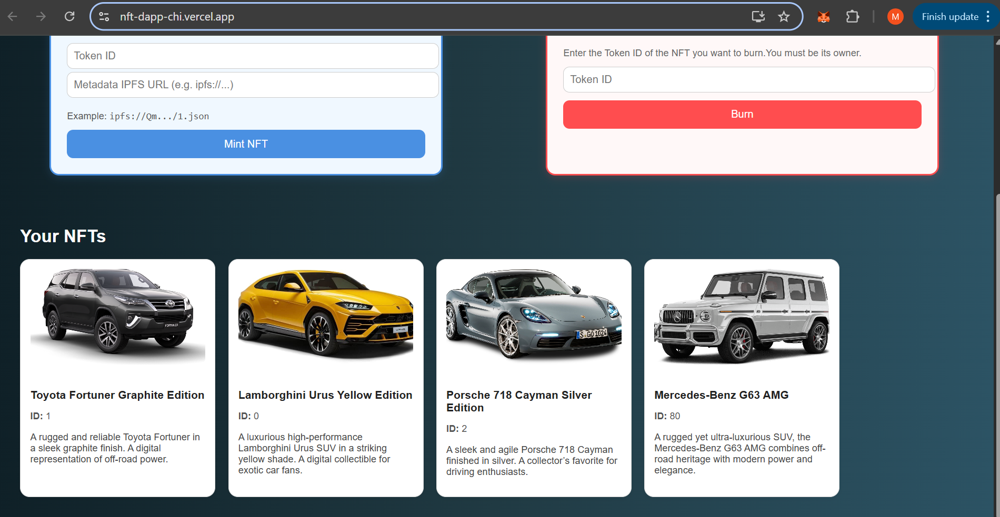

# 🖼️ NFT-dapp – Mint, Preview & Burn NFTs on Avalanche C-Chain

Welcome to **NFT-dapp** , a full-stack decentralized application that lets users preview, mint, and burn NFTs on the **Avalanche C-Chain**. With real-time wallet integration and an intuitive interface, users can manage their NFTs seamlessly. The dApp also features a dynamic gallery to view all NFTs owned by the connected address.

## 📖 Description

- NFT-dapp allows users to create, preview, and manage NFTs directly on the Avalanche blockchain. Before minting an NFT, users can preview how it will look by supplying a token ID and IPFS metadata link (e.g., ipfs://Qm.../1.json). The app fetches and renders metadata (image, name, description) in real-time.

- Additionally, NFT holders can securely burn their tokens, with a strict on-chain check ensuring only the rightful owner can perform the deletion. A visual NFT gallery allows users to explore all their tokens minted via this dApp, creating a seamless and interactive NFT experience.

> 🔥 Built using React, OpenZeppelin, Remix, and IPFS. Hosted on [Vercel](https://vercel.com).

---

## 🚀 Features

- 💿 **Token ID + URI Input** – Enter your token ID and IPFS JSON URI to mint NFTs
- 🔥 **Burn NFTs** – Easily burn NFTs; only owners can burn
- 🔍 **Live NFT Preview** – See the NFT preview before minting and burning
- 🖼️ **NFT Gallery** – Displays all NFTs owned by the connected wallet (on my contract only)
- 🌐 **IPFS Fallback Gateway** – Uses `https://nftstorage.link/ipfs/` for reliable image access
- 🧙‍♂️ **MetaMask Wallet Integration**
- 📦 Deployed on **Avalanche Fuji Testnet (or C-Chain)**

---

## 💻 Tech Stack

| Layer          | Tech                                                              |
| -------------- | ----------------------------------------------------------------- |
| Smart Contract | Solidity, OpenZeppelin (ERC721, Burnable, Enumerable, URIStorage) |
| IDE            | Remix                                                             |
| Frontend       | React.js, Ethers.js, IPFS                                         |
| Wallet         | MetaMask                                                          |
| Hosting        | Vercel                                                            |

---

## 📷 Screenshots

| Website Preview                                 | Mint Preview                             | NFT Gallery                              | 
| ----------------------------------------------- | ---------------------------------------- | ---------------------------------------- |
| . |  |  |

---

## ⚙️ Smart Contract

Deployed via Remix using OpenZeppelin Contracts v5.

```solidity
function safeMint(uint256 tokenId, string memory uri) public;
function burn(uint256 tokenId) public; // Only owner
function tokenOfOwnerByIndex(address owner, uint index) external view returns (uint256);
```

> 🔗 Contract Name: `Gunani`\
> 🧠 Deployed to: **Avalanche Fuji Testnet / C-Chain**\
> 📦 Contract Address: `0x1eb8F1a1d776B5DEE476e921325e217e0a11A62A`

---

## 🌐 Live App

> 🟢 https://nft-dapp-chi.vercel.app/    
> Make sure MetaMask installed in your browser. 
---

## 🛠️ How to Run Locally

1. **Clone the Repo**

```bash
git clone https://github.com/mohit1221iitian/NFT-DApp.git
cd NFT-DApp
```

2. **Install Dependencies**

```bash
npm install
```

3. **Run the App**

```bash
npm start
```

> You must connect a MetaMask wallet on the same network as your deployed contract.

---

## 🌥️ IPFS Gateway Handling

To avoid rate-limiting errors (`429 Too Many Requests`), the app automatically converts:

```
ipfs://Qm.../file.json
```

to:

```
https://nftstorage.link/ipfs/Qm.../file.json
```
if unavailable, it uses fallback :

```
https://cloudflare-ipfs.com/ipfs/Qm.../file.json
```
This ensures images and metadata load correctly under heavy traffic or network issues.

---

## 🧠 Known Limitations

- Only NFTs minted through this specific contract will be visible in the gallery.
- Some wallets may cache burnt NFTs temporarily even after they are removed on-chain.

---

## 🧱️ Problems I Faced During Development

- ❌ **429 Too Many Requests** from Pinata gateway:\
  → Solved by switching to NFT.storage and Cloudflare fallback.

- ⚠️ **MetaMask not showing correct NFT state** after burning:\
  → MetaMask caches NFTs; this was not an issue with the contract.

- 🔍 **Invalid JSON error** while fetching metadata:\
  → Happened when gateway returned HTML (e.g. rate-limited or offline). Resolved using proper IPFS URL parsing and proxy API.

- 🦠 **Showing more NFTs in wallet than contract holds**:\
  → Due to caching issues and wallet indexing, not a backend bug.

- 💭 **Image not showing from `ipfs://` URIs**:\
  → Solved by rewriting all URIs to nftstorage.link and cloudflare-ipfs.com.

---

## ✨ Future Improvements

- 🎨 On-chain trait randomization
- 📊 Rarity analysis & sorting in gallery
- 📦 Batch minting support
- 🎉 Cross-chain minting/bridging support

---

## 🙌 Credits

- [OpenZeppelin Contracts](https://docs.openzeppelin.com/contracts)
- [Remix IDE](https://remix.ethereum.org)
- [IPFS](https://ipfs.tech)
- [Cloudflare IPFS Gateway](https://developers.cloudflare.com/distributed-web/ipfs-gateway/)
- [Avalanche C-Chain](https://avax.network)

---

## 📜 License

MIT © mohit1221iitian

